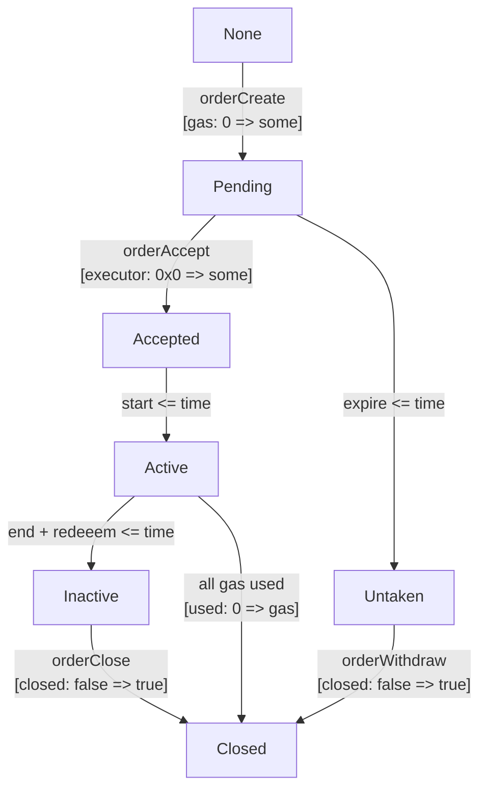
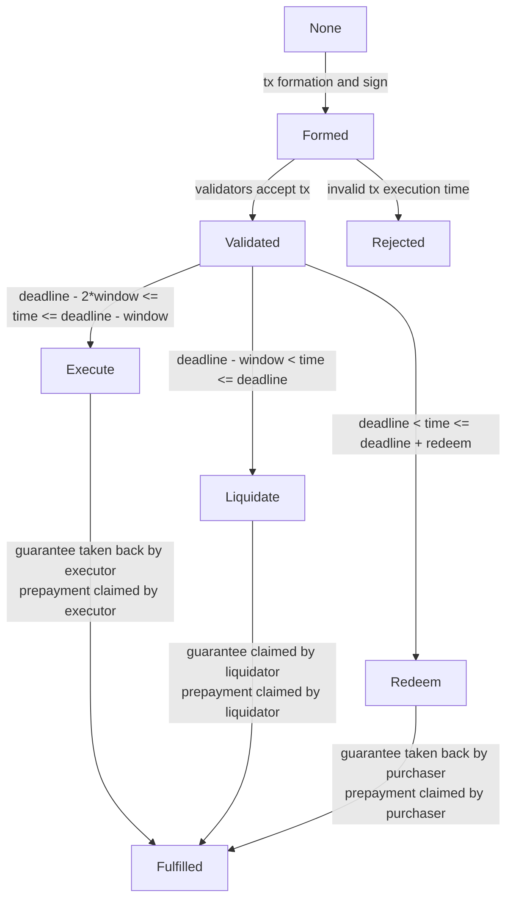

# prepaidGas DApp

Buy Gas now and use it later — First ETH Gas futures market

## Overview

TBD Explain main idea and actors

We support meta transactions `constructor(..) .. ERC2771Context(address(0x...)) {..}`

## Order Life Cycle

TBD Add statuses explanation



## Transaction Life Cycle

TBD Add statuses explanation



## Getting Started

TBD Explain repo structure, more details for setup

```sh
# Install dependencies
npm i


# Run frontend locally, any code changes causes immidiate effects
npm run fe-dev
# Run local hardhat node with mock-up setup
npm run sc-dev

# Execute both `fe-dev` and `sc-dev`
npm run dev


# Build Docker environment
npm run docker-build

# Run `dev` script in Docker
npm run docker-dev
# Run `dev` script in Docker (adapted for PowerShell)
npm run docker-dev-windows
```

Note: `-dev` instructions are affected by the [`dev` script](packages/contracts/package.json) contains `sleep 12` instuction which may need to be reconfigured in case of node start takes more than 10 seconds
