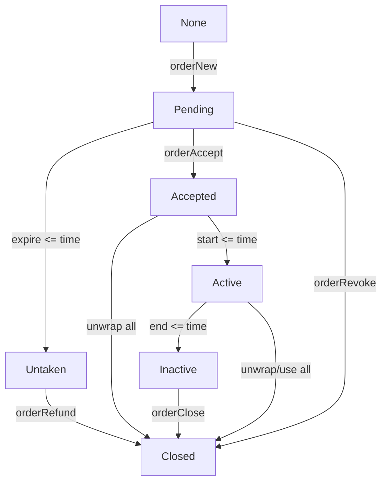

# Prepaid Gas Platform

[prepaidgas.io](https://prepaidgas.io/)

## Getting Started

```sh
# Install dependencies
npm i

# Run frontend locally, any code changes causes immidiate effects
npm run fe-dev
# Run linter on the fronend code
npm run fe-lint
# Run local hardhat node with mock-up setup
npm run sc-node-mock
# Run smart contract tests
npm run sc-test
# Run smart contract coverage tool
npm run sc-coverage

# Execute both `fe-dev` and `sc-node-mock`
npm run dev-setup
```

Note: `dev-setup` and `sc-node-mock` instructions are affected by [`node-mock` script](packages/contracts/package.json) contains `sleep 12` instuction which may need to be reconfigured in case of node start takes more than 10 seconds

## Gas Order

### State Diagram


